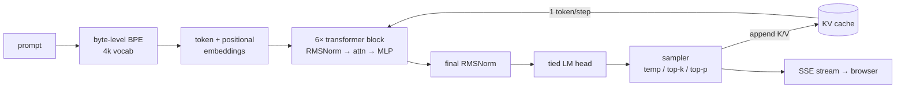

# tiny-llm

A **12M-parameter GPT trained from scratch** on TinyStories, with a hand-built inference
stack: byte-level BPE tokenizer, KV-cache streaming generation, top-p sampling, int8
quantization, and an SSE server with a live web UI.

> Not "I built an LLM." A precise claim: a small language model trained end to end, plus
> the inference engine around it, built and measured piece by piece.

<!-- Add your live demo link here once deployed to Hugging Face Spaces:
**▶ [Live demo](https://huggingface.co/spaces/<your-username>/tiny-llm)** -->

---

## What's in it

| Component | What it is |
|---|---|
| **Tokenizer** | Byte-level BPE trained on TinyStories, 4,096 vocab, 1.15 tokens/word |
| **Model** | 12.29M-param GPT — 6 layers, 6 heads, 384 dim, RMSNorm pre-norm, weight-tied head |
| **Training** | AdamW + cosine schedule, mixed precision, 30k steps on a free Kaggle T4 |
| **KV cache** | O(T²)→O(T) generation, proven identical to naive recompute, **7.4× faster @256 ctx** |
| **Sampling** | Temperature, top-k, and top-p (nucleus) — from scratch |
| **Quantization** | int8 per-channel weights — **3.96× smaller, +0.03% perplexity** |
| **Serving** | FastAPI, token-by-token SSE streaming, byte-safe incremental decode, web chat UI |

## Architecture



## Results

### Training

Trained 30,000 steps on a single free Kaggle T4. Validation loss falls smoothly and
converges near **1.74** — train and val track each other the whole way (no overfitting).


### KV cache

Naive generation recomputes attention over the whole prefix every step (O(T²) total). The
cache stores each layer's keys/values so every step processes just one token (O(T)). Both
paths produce **identical tokens** — the cache is proven to never change the output.

| context | naive | cached | speedup |
|--:|--:|--:|--:|
| 64 | 21.6 tok/s | 69.2 tok/s | 3.2× |
| 128 | 15.5 | 74.7 | 4.8× |
| 256 | 8.1 | 65.4 | **7.4×** |
| 512 | 4.3 | 48.7 | 11.2× |


*(CPU, 12M model. 256 is the model's context length; the 512 point uses a longer-context
config to show the trend continues.)*

### int8 quantization

Per-output-channel symmetric int8 on all Linear weights, with the tied token-embedding /
LM-head matrix quantized once and shared:

| scope | size | reduction | perplexity Δ |
|---|--:|--:|--:|
| fp32 baseline | 49.2 MB | — | — |
| Linear-only | 19.0 MB | 2.59× | +0.03% |
| **full (tied embeddings)** | **12.4 MB** | **3.96×** | **+0.03%** |

## Sample generations

> **Once upon a time** there was a little girl called Lucy. She was three years old and
> loved playing outside. One day she went out to the garden with her mum and dad. She saw a
> big root growing in the ground and wanted to touch it. Her mum said to her, "No, Lucy!
> That root is not for playing. You have to be careful."

> **One day, a little girl named Lily found a** big rock in her yard. She thought it was a
> very special rock. She showed it to her friend, Tom… They decided to use the rock to make
> a big tower. They worked together… They were very happy with their big tower.

> **The little robot beeped and** said, "Let's play together!" They played tag and
> hide-and-seek. They laughed and had a lot of fun.

## Quickstart

```bash
git clone https://github.com/RazaAslam161/tiny-llm
cd tiny-llm
python -m venv .venv && .venv/Scripts/activate      # Windows; use source .venv/bin/activate on macOS/Linux
pip install -r requirements.txt

pytest                                               # 45 tests

# with a trained checkpoint at checkpoints/ckpt_final.pt:
python run_demo.bat                                  # or: uvicorn serve.server:app --port 8000
# open http://localhost:8000
```

Train your own tokenizer and reproduce the evals:

```bash
python -m tokenizer.train_tokenizer --mb 50 --vocab-size 4096   # -> tokenizer/tokenizer.json
python -m evals.plot_loss --csv checkpoints/loss_log.csv        # loss curve
python -m evals.bench                                           # KV-cache benchmark
python -m evals.perplexity --scope full                         # quantization: size + perplexity
```

GPU training runs on Kaggle — see [`train/kaggle_train.ipynb`](train/kaggle_train.ipynb).

## Repository layout

```
tokenizer/   byte-level BPE: train / encode / decode / save / load
model/       GPT decoder + config (RMSNorm, causal attention, tied head)
train/       memmap dataset builder, AdamW+cosine training loop, sampler, Kaggle notebook
serve/       KV cache, generation engine, sampler, int8 quantizer, FastAPI server
evals/       loss curve, KV-cache benchmark, fp32-vs-int8 perplexity
web/         single-page streaming chat UI
tests/       45 tests — roundtrip, causality, cache equivalence, sampler, quantizer, server
```

## Limitations

Honest scope: this is a **12M-parameter** model trained on **English children's stories**.
It writes simple, mostly-grammatical TinyStories-style prose with occasional logic slips,
and it only knows that one domain — any prompt gets continued as a children's story.
Because it uses **learned absolute** position embeddings, generation is capped at its
256-token context (a limitation that motivates relative schemes like RoPE). It is a
from-scratch systems project, not a general-purpose chatbot.

## Deployment

See [`deploy/`](deploy/) for Hugging Face Spaces instructions. The `Dockerfile` serves the
quantized model on CPU — small and snappy on the free tier.

---

*Built with [Claude Code](https://claude.com/claude-code).*
