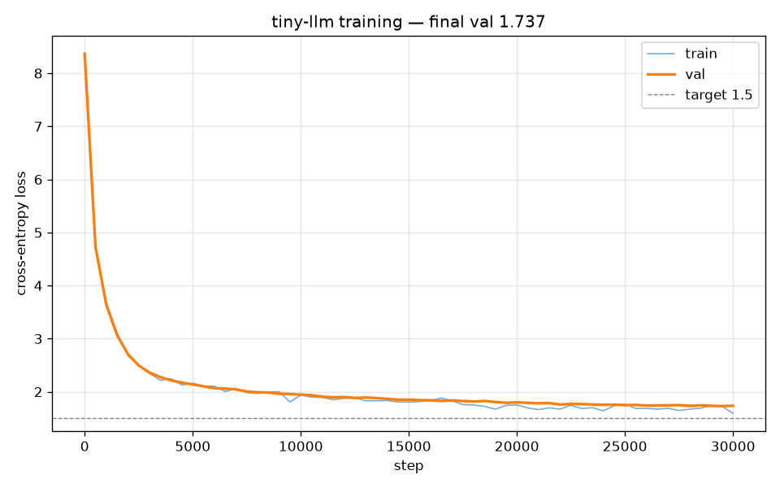
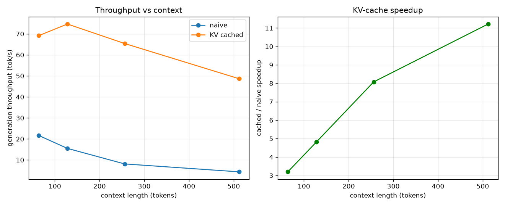

# tiny-llm

Small GPT (12M params) trained from scratch on TinyStories, plus the inference
stack around it: byte-level BPE, a KV cache, top-p sampling, int8 quantization,
and a FastAPI server that streams tokens to a web page.

It writes short children's stories. That's the only thing it knows how to do.

## What's here

- tokenizer: byte-level BPE, 4096 vocab, about 1.15 tokens/word on TinyStories
- model: 6 layers, 6 heads, 384 dim, RMSNorm pre-norm, weight-tied head. 12.29M params
- training: 30k steps on a free Kaggle T4, val loss around 1.74
- KV cache: ~7.4x faster generation at 256-token context (table below)
- int8 quant: checkpoint 3.96x smaller, perplexity moves +0.03%

## KV cache

Naive generation reruns attention over the whole prefix every step, so cost
grows with length. The cache keeps each layer's keys and values, so a step only
processes the new token. Output is the same either way, there's a test that
checks the logits match.

| ctx | naive | cached | speedup |
|--:|--:|--:|--:|
| 64 | 21.6 tok/s | 69.2 tok/s | 3.2x |
| 128 | 15.5 | 74.7 | 4.8x |
| 256 | 8.1 | 65.4 | 7.4x |
| 512 | 4.3 | 48.7 | 11.2x |

256 is the model's context length. The 512 row uses a longer-context config to
show the trend keeps going.




## Run it

```
python -m venv .venv
.venv\Scripts\activate            # source .venv/bin/activate on mac/linux
pip install -r requirements.txt
pytest
```

Serving needs a trained checkpoint at `checkpoints/ckpt_final.pt`:

```
uvicorn serve.server:app --port 8000
# open http://localhost:8000
```

`run_demo.bat` does the same thing on Windows.

Reproduce the evals:

```
python -m tokenizer.train_tokenizer --mb 50 --vocab-size 4096
python -m evals.bench
python -m evals.perplexity --scope full
```

GPU training runs as a Kaggle notebook, see `train/kaggle_train.ipynb`.

## Layout

```
tokenizer/   byte-level BPE (train / encode / decode / save / load)
model/       GPT decoder + config
train/       dataset builder, training loop, sampler, kaggle notebook
serve/       kv cache, generation engine, sampler, int8 quant, fastapi server
evals/       loss curve, kv-cache benchmark, fp32 vs int8 perplexity
web/         streaming chat page
tests/       45 tests
```

## Known issues

- 12M params, English children's stories only. Any prompt gets continued as a story.
- absolute position embeddings cap generation at 256 tokens. would need RoPE to slide past that.
- samples have the odd logic slip. small model, expected.
- the 512-ctx benchmark number is one machine and a bit noisy, want to average more runs.
